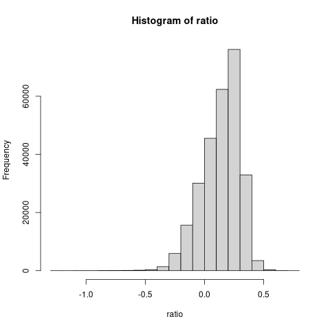
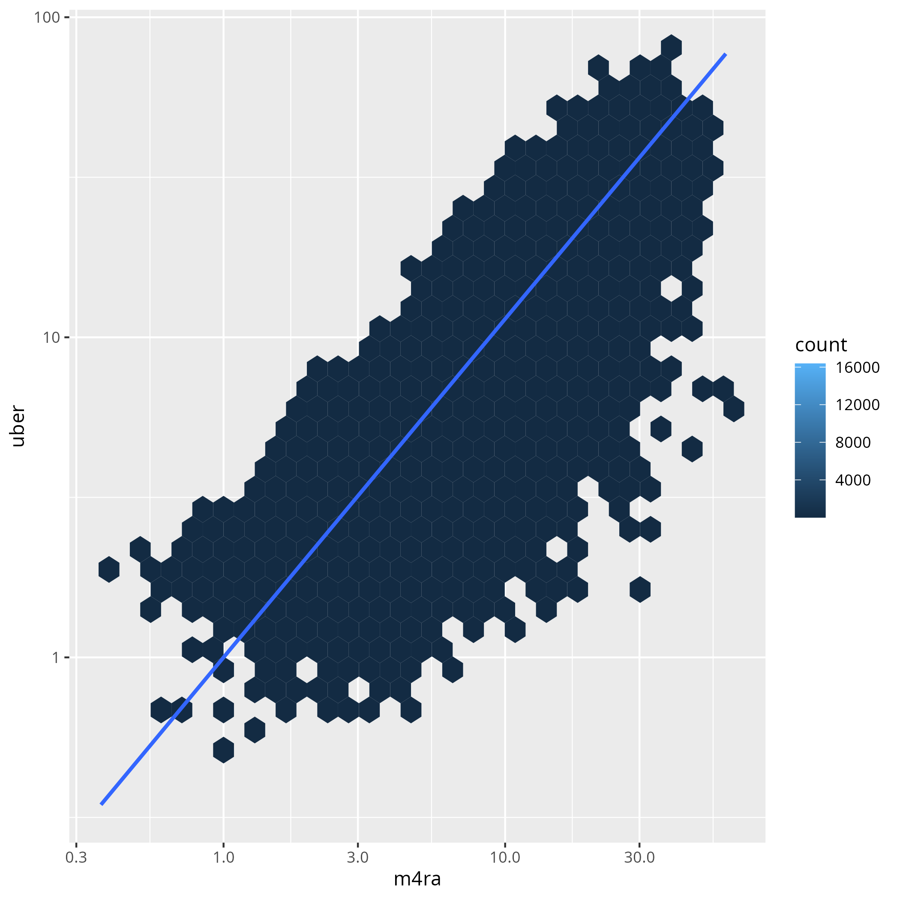

[](https://github.com/UrbanAnalyst/ttcalib/actions?query=workflow%3AR-CMD-check)
[](https://www.repostatus.org/#concept)

# ttcalib: Calibration of travel times to empirical data

One metric used throughout this organisation is travel times relative to
equivalent times taken by motorcars. This repository documents procedures used
to calibrate estimates of motorcar travel times to empirical data.

## Empirical Data

### Uber movement data

The empirical data are from [Uber movement](https://movement.uber.com/), with
these analyses calibrating against [data from Santiago,
Chile](https://movement.uber.com/explore/santiago/travel-times?lang=en-US).
The data used are the "All Data" version for the first quarter of 2020, grouped
by "Hour of Day". That download tab also includes a link to the "Geo
Boundaries", which are also required. Both of these data should be saved to a
local directory.

### OSM Network data

The Uber movement data extend over a far greater boundary than the "Santiago"
boundary returned by Nominatim. The OSM network data were therefore obtained
here from the complete Chile `pbf` file downloaded from Geofabrik, and then
processed with `osmium-tools` by:

1. Trimming to bbox of (-71.363,-33.851,-70.377,-33.113)
2. Constructing separate keyword-filtered subsets with keywords of: "highway",
   "restriction", "access", "bicycle", "foot", "motorcar", "motor_vehicle",
   "vehicle", "toll".
3. Convert all of these single `pbf` files to `osm` (XML) format.
4. Read in each via
   [`osmdata::osmdata_sc()`](https://docs.ropensci.org/osmdata/reference/osmdata_sc.html),
   and combine all data into single `osmdata_sc` object.

## Procedure

After loading this package with `devtools::load_all()`, run the following code:

```{r geo-uber-data, eval = FALSE}
path <- "/<path>/<to>/<uber>/<data>"
city <- "santiago"
geodata <- ttcalib_geodata (path = path, city = city)
uberdata <- ttcalib_uberdata (path = path, hours = c (7, 10), city = city)
```

Then convert the `osmdata_sc` object into a "dodgr" streetnet by specifying the
local path to the object stored in `.Rds` format and running this function:

```{r wt-streetnet, eval = FALSE}
graph <- ttcalib_streetnet ("<path>")
```

Finally, use those three objects to generate vehicular traveltime estimates
from [the `m4ra` package](https://github.com/atfut ures/m4ra), and to compare
those with the emprical estimates from the Uber movement data:

```{r traveltimes, eval = FALSE}
dat <- ttcalib_traveltimes (graph, geodata, uberdata)
```

That calculation shouild only take around a minute or so, and generates a
`data.frame` with two columns, "m4ra" and "uber", containing estimated and
observed travel times between around 250,000 origin and destination points.

## Results

The two travel times should both broadly agree in scale, and should be very
strongly positively correlated.

### Scale

The scales of the two can be compared by calculating a ratio, which should be
close to one, although it is likely that the `m4ra` travel times may be
slightly higher due to reflecting idealised conditions. The following graph
shows the distributions of relative scales of the two, on a logarithmic scale
so that equal scales correspond to a value of zero.



The median log-10 ratio is -0.162, or a ratio of 0.689, implying that the
observed times are slightly over 30% *faster* than the estimated times.

### Correlation

The estmiated and observed travel times are highly correlated, with an
R-squared value of around 0.67, or 0.942 on a logarithmic scale. These values
compare with equivalent values generated for the paper, [*Predicting commuter
flows in spatial networks using a radiation model based on temporal
ranges*](https://www.nature.com/articles/ncomms6347), of 0.639 for raw data,
calculated on a logarithmic scale, and 0.752 factoring in centrality.


